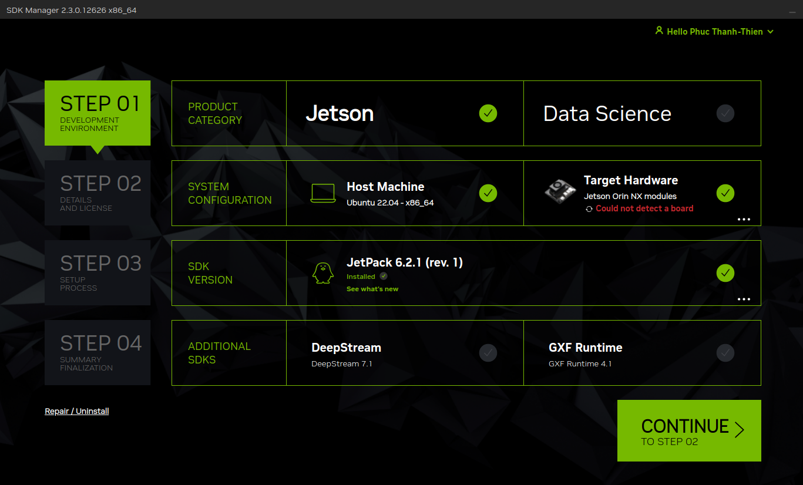
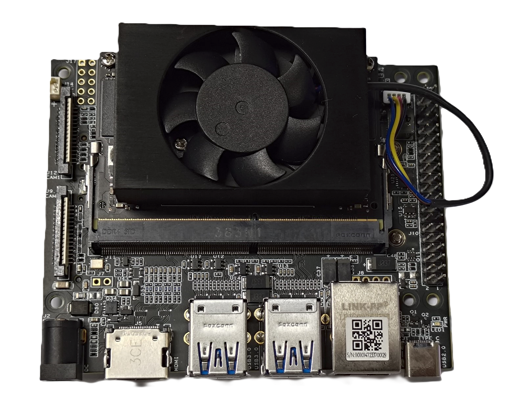
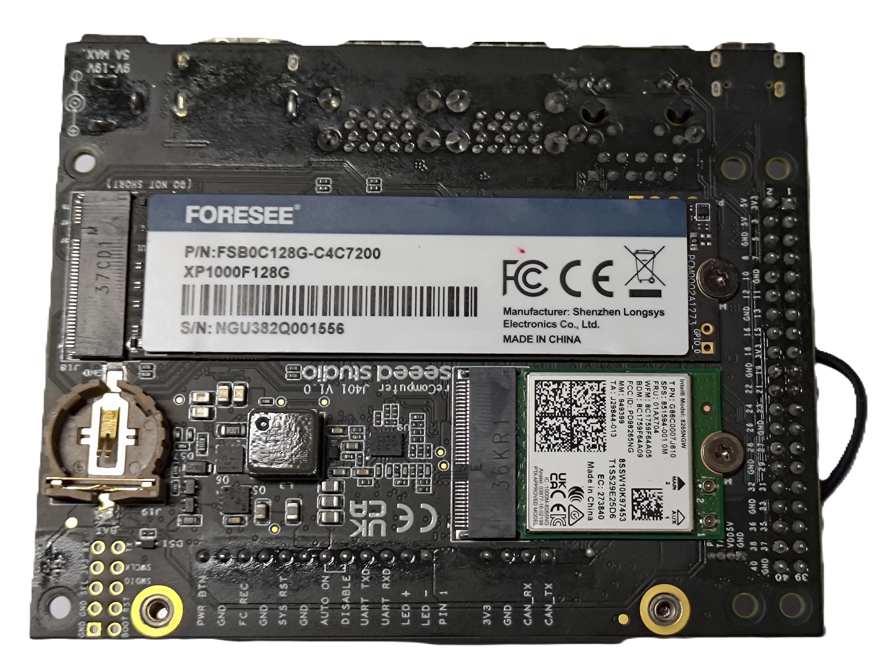
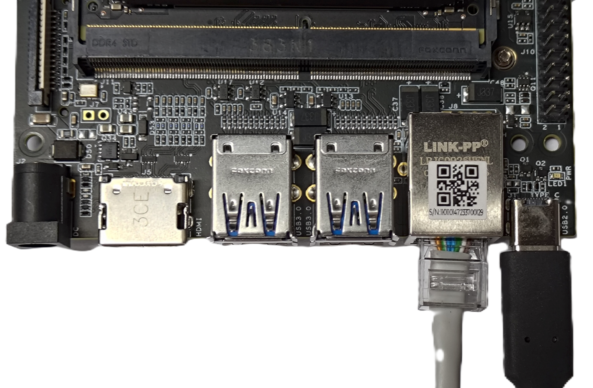
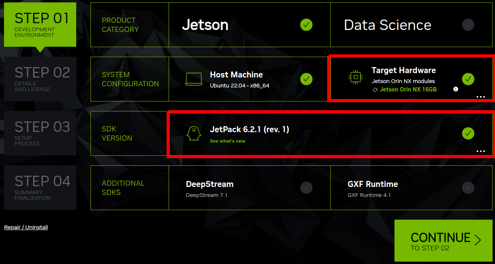
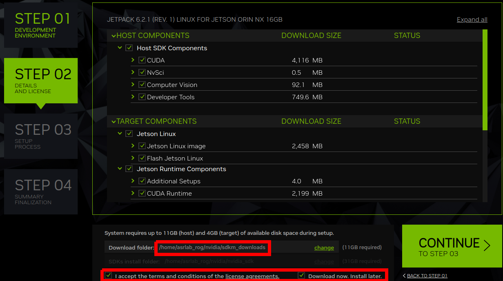
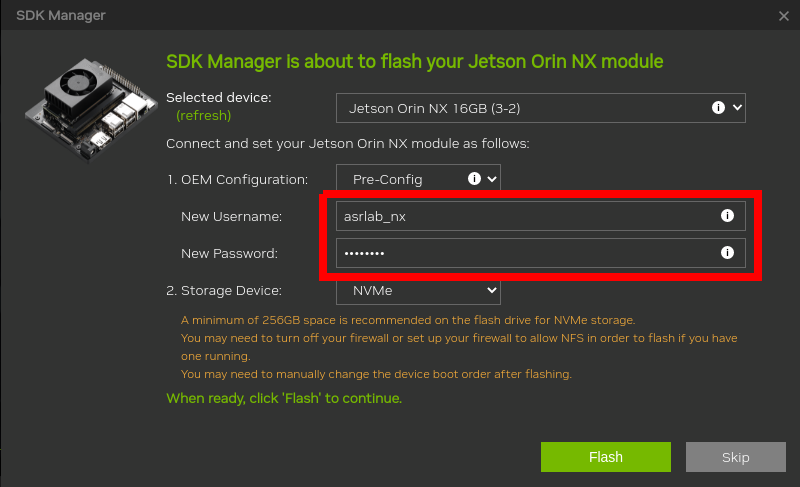
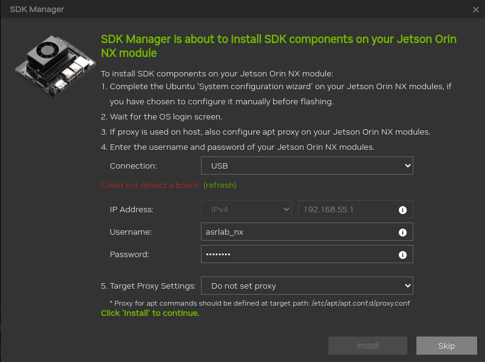
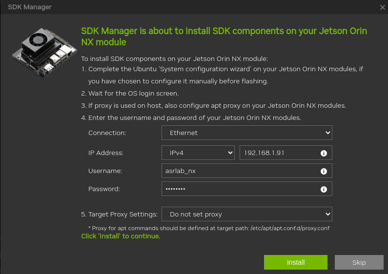
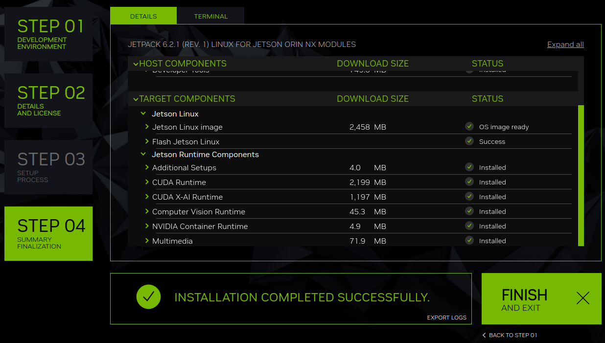

# A Guide to JetPack Setup via the NVIDIA SDK Manager

**NVIDIA Jetson** is a powerhouse embedded toolkit, but before you can start building amazing robotics and edge AI applications, you need to flash it with the necessary operating system and software libraries. The official tool for this is the [**NVIDIA SDK Manager**](https://developer.nvidia.com/sdk-manager).

This guide will walk you through the entire process of using the SDK Manager to install JetPack, the all-in-one software suite that includes the **Ubuntu OS**, **CUDA Toolkit**, **cuDNN**, **TensorRT**, and more, onto your Jetson device.

## I. Prequisition

Before you begin, make sure you have the following:

- **An NVIDIA Jetson Developer Kit:** A Jetson Orin NX in this guide.
- **A Host Computer:** A separate machine running a native installation of Ubuntu OS. For **JetPack 6.2.x**, the host machine should run **Ubuntu 22.04**. A virtual machine is **not recommended** as it can cause issues with USB device detection.
- **Storage:** At least **60 GB** of free space on your host computer to download and store the installation files.
- **Internet Connection:** For several gigabytes in size downloads.
- **Cables:** USB-C (3.0 or above) to connect the Jetson to the host machine.
- **Jetson Peripherals:** A monitor, keyboard, and mouse for initial setup on the Jetson device after it has been flashed.

In summary, the requirements of the host machine is listed as belows:

| Specitication |      |
| :------------ | :--- |
| Operating System | Ubuntu 22.04 LTS |
| Memory | At least 8 GB |
| Storage | At least 60 GB NVMe SSD |
| Internet | A reliable internet connection |

With **JetPack 6.2.x**, the **Jetson Orin NX**'s target system will come as belows:

| Specitication |      |
| :------------ | :--- |
| Operating System | Ubuntu 22.04 based system  |
| Memory | At least 8 GB |
| Storage | At least 60 GB NVMe SSD |
| Internet | A reliable internet connection |

## II. NVIDIA SDK Manager Installation

The **NVIDIA Software Development Kit (SDK) Manager** provides an end-to-end development environment setup solution for Jetson device. To flash the system on the Jetson device, the **NVIDIA SDK Manager** need to be installed on a Linux host machine.

The **NVIDIA SDK Manager** can be downloaded [here](https://developer.nvidia.com/nvidia-sdk-manager).

```sh
wget https://developer.download.nvidia.com/compute/cuda/repos/ubuntu2204/x86_64/cuda-keyring_1.1-1_all.deb
sudo dpkg -i cuda-keyring_1.1-1_all.deb
sudo apt update && sudo apt -y install sdkmanager
```

The **NVIDIA SDK Manager** can be started by using one of the following two methods:

1. Launch the SDK Manager from Ubuntu launcher.
2. Run the following command:

```sh
sdkmanager
```



## III. Jetson Orin NX Flashing on NVMe SSD

On the Jetson Orin NX device, an NVMe SSD is recommended to be mounted as the storage compoment in stead of SD card. The primary reasons are that NVMe SSD has larger storage, provides a massive performance increase (i.e., much faster boot time, quicker application loading) and an improved reliability and endurance.

Jetson Orin NX device (top-side).



Jetson Orin NX device (bottom-side) with the mounted NVMe SSD.



**Step 00:** Before flashing the Jetson device, it is required to set up the **Forece Recovery Mode** of the hardware by placing a jumper across `FC REC (10)` and `GND (9)` pins.


Connect the host computer to the target Jetson by the **USB-C** connector and **Ethernet RJ45** connector for Internet access (optional).

Finally, connect the power connect to the power jeck. The Jetson device will automatically boot into the **Force Recovery Mode**.



**Step 01:** After launching **NVIDIA SDK Manager**, select the **Target Hardware** as `Jetson Orin NX 16GB` and **SDK Version** as `Jetpack 6.2.1 (rev. 1)` (current latest).



Click to `CONTINUE TO STEP 02` to move on the next step.

**Step 02:** Download the host and target components. 

Select the **Download folder** as `$HOME/nvidia/sdkm_downloads`. To guarantee all packages being downloaded, check `Download now. Install later.` and click `CONTINUE TO STEP 03` to download.



When the download are complete, click `BACK TO STEP 01`. Then click `CONTINUE TO STEP 02` again and only select `I accept the terms and conditions of the license agreements.`.

Click `CONTINUE TO STEP 03` for the further process.

**Step 03:** Flash the target Jetson device. Set up the **New Username** and **New Password** and select **Storage Deivce** as `NVMe`.



Waiting untill the installation finished. If there any issue, back the step and redo.

**Step 04**: After flashing successfully, the **SDK Manager** will show a sub-window as belows.



Now, connect the target Jetson to a monitor, keyboard and mouse and you can directly log-in to the Jetson device.

Check the IPv4 address in the Jetson device. Notice that the host machine and the target Jetson are in a same local network. Then back to the host machine, configure the connection settings to install SDK components on the Jetson device.



When the installation is complete, you can move to the Jetson Orin NX device to do your work.



## IV. Jetson Orin NX Setup

Before setting up the Jetson device, you can remove the jumper to exit the **Forece Recovery Mode**. 

After logging in the Jetson device, update the system:

```sh
sudo apt update -y && sudo apt upgrade -y
```

Install `nvidia-jetpack`.

```sh
sudo apt install -y nvidia-jetpack
```

To verify a successful SDK component installation on a **Jetson Orin NX**, you can use several methods from the Jetson's command-line interface. These commands allow you to check the installed JetPack version and confirm that core components like CUDA, TensorRT, and cuDNN are present. 

### 1. Checking JetPack Version

The JetPack version indicates which suite of software and libraries has been installed. It includes:

- **CUDA Toolkit:** For GPU-accelerated computing.
- **cuDNN:** GPU-accelerated library for deep learning.
- **TensorRT:** Optimizer and runtime for AI inference.
- **OpenCV:** Optimized computer vision libraries.
- **Linux for Tegra (L4T):** A customized Ubuntu-based OS with GPU drivers.

Each JetPack version corresponds to a specific **L4T version**, CUDA version, and TensorRT version

```sh
dpkg-query --show nvidia-l4t-core
```

The output would be:

```txt
nvidia-l4t-core	36.4.4-20250616085344
```

The L4T version is `36.4.4`, which indicates the JetPack version `4.2.1`.

### 2. Checking Component Versions

You can verify specific SDK components directly from the terminal.

#### Checking CUDA Version

Use the `nvcc` compiler's version command to check if CUDA is installed and identify its version.

```sh
nvcc --version
```

The output should be:

```sh
nvcc: NVIDIA (R) Cuda compiler driver
Copyright (c) 2005-2024 NVIDIA Corporation
Built on Wed_Aug_14_10:14:07_PDT_2024
Cuda compilation tools, release 12.6, V12.6.68
Build cuda_12.6.r12.6/compiler.34714021_0
```

#### Checking cuDNN Version

You can then read the version from the header file located here:

```sh
cat /usr/include/aarch64-linux-gnu/cudnn_version_v9.h | grep CUDNN_MAJOR -A 2
```

The output would be:

```txt
#define CUDNN_MAJOR 9
#define CUDNN_MINOR 3
#define CUDNN_PATCHLEVEL 0
--
#define CUDNN_VERSION (CUDNN_MAJOR * 10000 + CUDNN_MINOR * 100 + CUDNN_PATCHLEVEL)

/* cannot use constexpr here since this is a C-only file */
```

#### Checking TensorRT Version

The version encoded in the library file itself is confirmed by command: 

```sh
nm -D /usr/lib/aarch64-linux-gnu/libnvinfer.so | grep tensorrt_version
```

The output would be:

```txt
... B tensorrt_version_10_3_0_30
```

## Conclusion

You have successully flashed your Jetson Orin NX and unlocked a platform for edge AI and robotics. The next step would be the device real-time optimization and building your applications.
