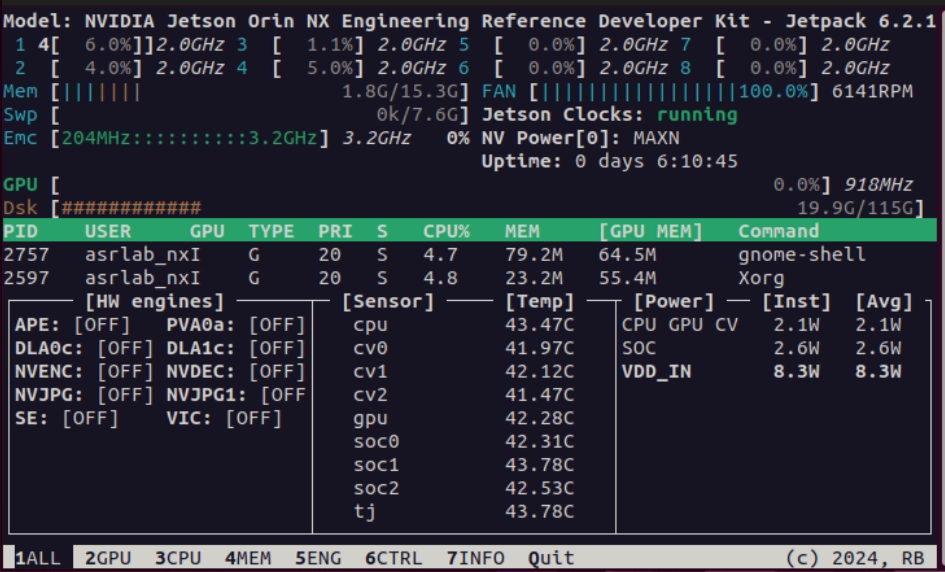

# A Guide to Jetson Orin NX Setup

Before you dive into building complex applications, there are a few essential configuration steps you should take to maximize performance, enable remote access, and improve usability.

This guide will walk you through setting the power mode, controlling the fan, installing the monitoring tool, enabling SSH, and installing a compatible web browser.

## I. Setting Jetson Performance

### 1. Setting Maximum Perfomance Power Mode

One Jetson devices, power modes significantly affect the performance of the system, particularly the CPU and GPU clock speeds. To make Jetson device achieves real-time perfomance, you need to set to its maximum performance configuration.

```sh
sudo nypmodel -m 0
```

### 2. Setting Maximum Clocks for CUP and GPU

To ensure real-time performance, you have to set static, high clock frequencies for CPU, GPU, and memory. Run th command:

```sh
sudo jetson_clocks
```

The effect of `jetson_clocks` is not permanent acrros reboots by default. To run `jetson_clocks` automatically at startup, you can create a `systemd` service.

1. Create a new service file in the `etc/systemd/system/` directory.

```sh
sudo nano /etc/systemd/system/jetson_clocks.service
```

2. Add the following content to the file. This creates a service that will run `jetson_clocks` after the networking and power management services have started.

```txt
[Unit]
Description=Maximize Jetson Performance
After=network.target nvpmodel.service

[Service]
Type=oneshot
ExecStart=/usr/bin/jetson_clocks
RemainAfterExit=yes

[Install]
WantedBy=multi-user.target
```

3. Enable the service.

```sh
sudo systemctl enable jetson_clocks.service
```

4. Start the service.

```sh
sudo systemctl start jetson_clocks.service
```

5. You can check the status of the new service to confirm it is running correctly.

```sh
sudo systemctl status jetson_clocks.service
```

The output should show that the service is `active (exited)` and that `jetson_clocks` ran successfully.

### 3. Setting Maximum Fan Speed

Setting the fan to its maximum speed on a Jetson device is done to prevent thermal throttling, which can cause significant and unpredictable latency spikes in real-time applications.

The `jetson_clocks` is the easiest and most reliable way to set the fan to maximum speed.

```sh
sudo jetson_clocks --fan
```

To make it persist after a reboot, a `systemd` service is needed that run the `jetson_clocks --fan` at startup.

1. Create a new service file in the `etc/systemd/system/` directory.

```sh
sudo nano /etc/systemd/system/jetson_clocks_fan.service
```

2. Add the following content to the file.

```txt
[Unit]
Description=Set Jetson Fan to Max Speed
After=multi-user.target

[Service]
Type=oneshot
ExecStart=/usr/bin/jetson_clocks --fan
RemainAfterExit=yes

[Install]
WantedBy=multi-user.target
```

3. Enable the service.

```sh
sudo systemctl enable jetson_clocks_fan.service
```

4. Start the service.

```sh
sudo systemctl start jetson_clocks_fan.service
```

5. You can check the status of the new service to confirm it is running correctly.

```sh
sudo systemctl status jetson_clocks_fan.service
```

The output should show that the service is `active (exited)` and that `jetson_clocks` ran successfully.

After finishing the configuration, reboot the Jetson device the see the change.

## II. System Monitoring

`jtop` is a much more comprehensive and user-friendly command-line tool for monitoring your Jetson.

```sh
sudo apt install -y python3-pip
sudo -H pip3 install -U jetson-stats
```

Run `jtop` using the following command:

```sh
jtop
```

You would see a detailed, real-time dashboard showing CPU, GPU, RAM, and power usage, as well as temperatures and library versions.



## III. SSH Enable for Remote Access

Working directly on the Jetson with a monitor and keyboard is fine, but it's often more convenient to access it remotely from your main development machine.

You need install **OpenSSH Server**. Please see the guide in [`02_setup_remote_ssh.md`](../../ubuntu_desktop/ubuntu_22.04/02_setup_remote_ssh.md) and [`03_manage_remote_sessions_with_tmux_and_ssh.md`](../../ubuntu_desktop/ubuntu_22.04/03_manage_remote_sessions_with_tmux_and_ssh.md) to setup **OpenSSH Server** and connect in your local computer.

## IV. Chromium Browser Installation

In `JetPack 6.2.1`, there are several unavailable `snap` features; therefore, some `snap` applications, like Firefox, Chromium browsers, cannot work correctly. The solution is install via `apt`.

To install Chomium browser, you add a trusted third-party PPA (Personal Package Archive) using `add-apt-repository`.

```sh
sudo add-apt-repository ppa:xtradeb/apps
```

Update package lists.

```sh
sudo apt update -y
```

Install Chromiunm

```sh
sudo apt install -y chromium
```

## V. Code Editor Installation

You can install **Visual Studio (VS) Code** in Jetson as a light-weight code editor in Jetson device.

```sh
wget https://update.code.visualstudio.com/latest/linux-deb-arm64/stable -O vscode.deb
```

Install the downloaded `.deb` package using `dpkg` command.

```sh
sudo apt dpkg -i vscode.deb
```

Then open the **VS Code** and ready to use.

## VI. Running Component Examples

Download the CMake's latest version [here](https://cmake.org/download/) and install it.

```sh
wget https://github.com/Kitware/CMake/releases/download/v4.1.0/cmake-4.1.1-linux-aarch64.sh

chmod +x cmake-4.1.1-linux-aarch64.sh

sudo ./cmake-4.1.1-linux-aarch64.sh --skip-licence --prefix=/usr/local --exclude-subdir

# check version
cmake --version
```

Install some development tools:

```sh
sudo apt install -y build-essential gcc make nano libglvnd-dev curl wget git
```

#### Running CUDA Toolkit Samples

CUDA samples are now located in [https://github.com/nvidia/cuda-samples](https://github.com/nvidia/cuda-samples), which includes instructions for obtaining, building, and running the samples.

Since CUDA version is `12.6` for JetPack 6.2.1, you clone the `cuda-samples` for `CUDA 12.5` using `git` command.

```sh
git clone --branch v12.5 --single-branch https://github.com/nvidia/cuda-samples cuda_samples
```

Go to `Samples/1_Utilities/deviceQuery` and compile.

```sh
cd Samples/1_Utilities/deviceQuery

make -j $(nproc)
```

After compilation, run `deviceQuery`.

```sh
./deviceQuery
```

The output would be as bellows:

```txt
./deviceQuery Starting...

 CUDA Device Query (Runtime API) version (CUDART static linking)

Detected 1 CUDA Capable device(s)

Device 0: "Orin"
  CUDA Driver Version / Runtime Version          12.6 / 12.6
  CUDA Capability Major/Minor version number:    8.7
  Total amount of global memory:                 15656 MBytes (16416792576 bytes)
  (008) Multiprocessors, (128) CUDA Cores/MP:    1024 CUDA Cores
  GPU Max Clock rate:                            918 MHz (0.92 GHz)
  Memory Clock rate:                             918 Mhz
  Memory Bus Width:                              256-bit
  L2 Cache Size:                                 2097152 bytes
  Maximum Texture Dimension Size (x,y,z)         1D=(131072), 2D=(131072, 65536), 3D=(16384, 16384, 16384)
  Maximum Layered 1D Texture Size, (num) layers  1D=(32768), 2048 layers
  Maximum Layered 2D Texture Size, (num) layers  2D=(32768, 32768), 2048 layers
  Total amount of constant memory:               65536 bytes
  Total amount of shared memory per block:       49152 bytes
  Total shared memory per multiprocessor:        167936 bytes
  Total number of registers available per block: 65536
  Warp size:                                     32
  Maximum number of threads per multiprocessor:  1536
  Maximum number of threads per block:           1024
  Max dimension size of a thread block (x,y,z): (1024, 1024, 64)
  Max dimension size of a grid size    (x,y,z): (2147483647, 65535, 65535)
  Maximum memory pitch:                          2147483647 bytes
  Texture alignment:                             512 bytes
  Concurrent copy and kernel execution:          Yes with 2 copy engine(s)
  Run time limit on kernels:                     No
  Integrated GPU sharing Host Memory:            Yes
  Support host page-locked memory mapping:       Yes
  Alignment requirement for Surfaces:            Yes
  Device has ECC support:                        Disabled
  Device supports Unified Addressing (UVA):      Yes
  Device supports Managed Memory:                Yes
  Device supports Compute Preemption:            Yes
  Supports Cooperative Kernel Launch:            Yes
  Supports MultiDevice Co-op Kernel Launch:      Yes
  Device PCI Domain ID / Bus ID / location ID:   0 / 0 / 0
  Compute Mode:
     < Default (multiple host threads can use ::cudaSetDevice() with device simultaneously) >

deviceQuery, CUDA Driver = CUDART, CUDA Driver Version = 12.6, CUDA Runtime Version = 12.6, NumDevs = 1
Result = PASS
```

Simmilarly, compile and run `bandwidthTest` program to ensures the system and CUDA-capable device are able to communicate correctly. 

```sh
cd Samples/1_Utilities/deviceQuery/bandwidthTest

make -j $(nproc)

./bandwidthTest
```

The output would be:

```txt
[CUDA Bandwidth Test] - Starting...
Running on...

 Device 0: Orin
 Quick Mode

 Host to Device Bandwidth, 1 Device(s)
 PINNED Memory Transfers
   Transfer Size (Bytes)	Bandwidth(GB/s)
   32000000			25.9

 Device to Host Bandwidth, 1 Device(s)
 PINNED Memory Transfers
   Transfer Size (Bytes)	Bandwidth(GB/s)
   32000000			25.7

 Device to Device Bandwidth, 1 Device(s)
 PINNED Memory Transfers
   Transfer Size (Bytes)	Bandwidth(GB/s)
   32000000			80.6

Result = PASS

NOTE: The CUDA Samples are not meant for performance measurements. Results may vary when GPU Boost is enabled.
```

Some CUDA samples use third-party libraries which may not be installed be default on the system.

```sh
sudo apt install -y g++ libfreeimage3 freeglut3-dev build-essential libx11-dev libxmu-dev libxi-dev libglu1-mesa-dev libfreeimage-dev libglfw3-dev
```

Run `simpleGL` example.

```sh
cd Samples/5_Domain_Specific/simpleGL

make -j $(nproc)

./simpleGL
```

The result would be:


#### Running cuDNN Samples

When installed via **NVIDIA JetPack SDK**, cuDNN samples for Jetson Orin NX are located in the `/usr/src/cudnn_samples_v9/` directory. Since the samples are installed in a system directory, you must copy them to your writable location before compiling them.

E.g.,

```sh
cp -R /usr/src/cudnn_samples_v9/ $HOME/projects/cudnn_samples
```

To compile `mnistCUDNN` sample, run the command:

```sh
cd cudnn_samples/mnistCUDNN

make CUDA_PATH=/usr/local/cuda-12.6 -j $(nproc)
```

Run the program.

```sh
./mnistCUDNN
```

You should get a bunch of output with the last line saying **Test passed!**.

To compile `conv_sample` sample, run the command:

```sh
cd cudnn_samples/conv_sample

make CUDA_PATH=/usr/local/cuda-12.6 -j $(nproc)
```

Run the program.

```sh
bash run_conv_sample.sh
```

You would get last line saying **Test PASSED**.

#### Running TensorRT Samples

The TensorRT samples are usually located within the JetPack installation, often in a directory like `/usr/src/tensorrt/samples`. Since the samples are installed in a system directory, you must copy them to your writable location before compiling them.

E.g.,

```sh
cp -R /usr/src/tensorrt/ $HOME/projects/tensorrt_samples
```

For C++ samples, go to the `samples/` directory to build all samples and then run one of samples:

```sh
cd ~/projects/tensorrt_samples/samples && make -j$(nproc) CUDA_INSTALL_DIR=/usr/local/cuda-12.6
```

Run the `sample_onnx_mnist` sample.

```sh
cd ../bin && ./sample_onnx_mnist
```

The output should be as follows:

```txt
&&&& RUNNING TensorRT.sample_onnx_mnist [TensorRT v100300] # ./sample_onnx_mnist
[09/15/2025-01:46:12] [I] Building and running a GPU inference engine for Onnx MNIST
[09/15/2025-01:46:12] [I] [TRT] [MemUsageChange] Init CUDA: CPU +13, GPU +0, now: CPU 31, GPU 3899 (MiB)
[09/15/2025-01:46:14] [I] [TRT] [MemUsageChange] Init builder kernel library: CPU +927, GPU +752, now: CPU 1001, GPU 4697 (MiB)
[09/15/2025-01:46:14] [I] [TRT] ----------------------------------------------------------------
[09/15/2025-01:46:14] [I] [TRT] Input filename:   ../data/mnist/mnist.onnx
[09/15/2025-01:46:14] [I] [TRT] ONNX IR version:  0.0.3
[09/15/2025-01:46:14] [I] [TRT] Opset version:    8
[09/15/2025-01:46:14] [I] [TRT] Producer name:    CNTK
[09/15/2025-01:46:14] [I] [TRT] Producer version: 2.5.1
[09/15/2025-01:46:14] [I] [TRT] Domain:           ai.cntk
[09/15/2025-01:46:14] [I] [TRT] Model version:    1
[09/15/2025-01:46:14] [I] [TRT] Doc string:       
[09/15/2025-01:46:14] [I] [TRT] ----------------------------------------------------------------
[09/15/2025-01:46:14] [I] [TRT] Local timing cache in use. Profiling results in this builder pass will not be stored.
[09/15/2025-01:46:16] [I] [TRT] Detected 1 inputs and 1 output network tensors.
[09/15/2025-01:46:16] [I] [TRT] Total Host Persistent Memory: 18976
[09/15/2025-01:46:16] [I] [TRT] Total Device Persistent Memory: 0
[09/15/2025-01:46:16] [I] [TRT] Total Scratch Memory: 0
[09/15/2025-01:46:16] [I] [TRT] [BlockAssignment] Started assigning block shifts. This will take 4 steps to complete.
[09/15/2025-01:46:16] [I] [TRT] [BlockAssignment] Algorithm ShiftNTopDown took 0.037499ms to assign 2 blocks to 4 nodes requiring 31744 bytes.
[09/15/2025-01:46:16] [I] [TRT] Total Activation Memory: 31744
[09/15/2025-01:46:16] [I] [TRT] Total Weights Memory: 25704
[09/15/2025-01:46:16] [I] [TRT] Engine generation completed in 1.72242 seconds.
[09/15/2025-01:46:16] [I] [TRT] [MemUsageStats] Peak memory usage of TRT CPU/GPU memory allocators: CPU 0 MiB, GPU 8 MiB
[09/15/2025-01:46:16] [I] [TRT] [MemUsageStats] Peak memory usage during Engine building and serialization: CPU: 1434 MiB
[09/15/2025-01:46:16] [I] [TRT] Loaded engine size: 0 MiB
[09/15/2025-01:46:16] [I] [TRT] [MemUsageChange] TensorRT-managed allocation in IExecutionContext creation: CPU +0, GPU +0, now: CPU 0, GPU 0 (MiB)
[09/15/2025-01:46:16] [I] Input:
[09/15/2025-01:46:16] [I] @@@@@@@@@@@@@@@@@@@@@@@@@@@@
@@@@@@@@@@@@@@@@@@@@@@@@@@@@
@@@@@@@@@@@@@@@@@@@@@@@@@@@@
@@@@@@@@@@@@@@@@@@@@@@@@@@@@
@@@@@@@@@@@@@@@@@@@@@@@@@@@@
@@@@@@@@@@@@@@@@@@@@@@@@@@@@
@@@@@@@%=#@@@@@%=%@@@@@@@@@@
@@@@@@@           %@@@@@@@@@
@@@@@@@           %@@@@@@@@@
@@@@@@@#:-#-.     %@@@@@@@@@
@@@@@@@@@@@@#    #@@@@@@@@@@
@@@@@@@@@@@@@    #@@@@@@@@@@
@@@@@@@@@@@@@:  :@@@@@@@@@@@
@@@@@@@@@%+==   *%%%%%%%%%@@
@@@@@@@@%                 -@
@@@@@@@@@#+.          .:-%@@
@@@@@@@@@@@*     :-###@@@@@@
@@@@@@@@@@@*   -%@@@@@@@@@@@
@@@@@@@@@@@*   *@@@@@@@@@@@@
@@@@@@@@@@@*   @@@@@@@@@@@@@
@@@@@@@@@@@*   #@@@@@@@@@@@@
@@@@@@@@@@@*   *@@@@@@@@@@@@
@@@@@@@@@@@*   *@@@@@@@@@@@@
@@@@@@@@@@@*   @@@@@@@@@@@@@
@@@@@@@@@@@*   @@@@@@@@@@@@@
@@@@@@@@@@@@+=#@@@@@@@@@@@@@
@@@@@@@@@@@@@@@@@@@@@@@@@@@@
@@@@@@@@@@@@@@@@@@@@@@@@@@@@

[09/15/2025-01:46:16] [I] Output:
[09/15/2025-01:46:16] [I]  Prob 0  0.0000 Class 0: 
[09/15/2025-01:46:16] [I]  Prob 1  0.0000 Class 1: 
[09/15/2025-01:46:16] [I]  Prob 2  0.0000 Class 2: 
[09/15/2025-01:46:16] [I]  Prob 3  0.0000 Class 3: 
[09/15/2025-01:46:16] [I]  Prob 4  0.0000 Class 4: 
[09/15/2025-01:46:16] [I]  Prob 5  0.0000 Class 5: 
[09/15/2025-01:46:16] [I]  Prob 6  0.0000 Class 6: 
[09/15/2025-01:46:16] [I]  Prob 7  1.0000 Class 7: **********
[09/15/2025-01:46:16] [I]  Prob 8  0.0000 Class 8: 
[09/15/2025-01:46:16] [I]  Prob 9  0.0000 Class 9: 
[09/15/2025-01:46:16] [I] 
&&&& PASSED TensorRT.sample_onnx_mnist [TensorRT v100300] # ./sample_onnx_mnist
```

For Python samples, the process involve the following steps:

1. Create a `mamba` environment. You can follow this [guide](../../ubuntu_desktop/ubuntu_22.04/04_setup_python_environment.md) to install `mamba` and learn how to use it. Since the current system using python verison `3.10`, create a environment with a same verions.

```sh
mamba create -n tensorrt_samples python=3.10
mamba activate tensorrt_samples
```

TensorRT's Python bindings are usually located in the system's dist-packages. To make them accessible within your Conda environment, you need to add this path to your `PYTHONPATH` in the `.bashrc` file.

```sh
# >>> TensorRT's Python bindings setup >>>
export PYTHONPATH=/usr/lib/python3.10/dist-packages:$PYTHONPATH
# <<< TensorRT's Python bindings setup <<<
```

Save, exit and then source `.bashrc` to activate the modification.

2. Install the `samples/python/requirements.txt` file.

```sh
pip install -r requirements.txt
```

2. Go to the specific sample folder, e.g., `introductory_parser_samples`, then install the `requirements.txt`.

```sh
cd introductory_parser_samples/ && pip install -r requirements.txt
```

3. Run the program.

```sh
python onnx_resnet50.py -d ../../../data
```

The output would be shown as bellows:

```sh
Correctly recognized /usr/src/tensorrt/data/resnet50/binoculars.jpeg as binoculars
```

## Conclusion

You have successfully configured the core settings for your Jetson Orin NX. By setting the optimal power mode, ensuring proper cooling, installing monitoring tools, and enabling remote access, you've created a much more robust and user-friendly development environment.