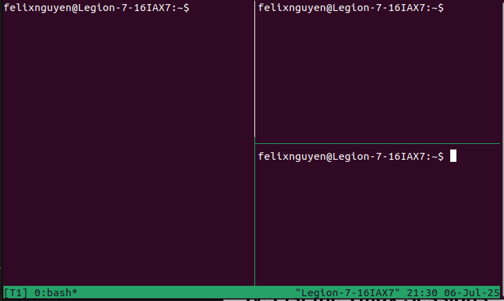

# A Guide to Manage Remote Sessions with Tmux and SSH on Ubuntu 22.04 - The Smart Way to Train Model or Run Long Jobs

If you are trianing deep learning models or running long simulations on a remote server via SSH, you must know this:

**"The process will die the moment the SSH sesion disconnect!"**

Unless you use **Tmux**.

**Tmux (Terminal Multiplexer)** is a powerfull command-line tool that allows you to:

- Run multiple terminal windows or panes in one session.
- Detach and reattch to terminal sessions at any time.
- Keep processes running **even if SSH disconnects**.
- Monitor things like `nvidia-smi`, logs, and scripts in split views.

This post guides you to setup **Tmux** so that you can mantain **SSH connections** to another Linux machine or server, e.g., GPU server, cloud VM, cluster node.

There are two parts:

1. Configure the **Tmux** on the **remote machine (server)**.
2. Manage **Tmux session** on the server.

## I. Tmux Installation

**Tmux** *MUST* be installed on the remote server, not just the local machine.

Here is why:

- **Tmux** create and manages terminal sesions on **the machine where it is run**.
- If you ssh into a server, you need `tmux` to be installed **on that server** to manage sessions there.

To install `tmux`, run the following command:

```sh
sudo apt install -y tmux
```

Verify the installed `tmux`.

```sh
tmux -V
```

## II. Tmux Session on Server

On the local machine, run `SSH` into the remote server.

```sh
ssh -p port user@rmeote_ip
```

Then start a `tmux` session.

```sh
tmux new -s session_name
```

**NOTE:** Giving a name is not strictly required, but it is very helpful when managing multiple sessions or reconnecting later.

## III. Working with Tmux Session

### 1. Detaching a Tmux Session

Pressing `Ctrl + D` will terminate a tmux session. To detach from the current session while keeping it running, use the following key sequence: `Ctrl + B` followed by `D`.

### 2. List the Tmux Sessions

The command `tmux ls` displays all tmux sessions currently running or alive on the system.

```sh
tmux ls
```

### 3. Attaching a Tmux session

From the output of the `tmux ls` command, you can identify all tmux session names. To attach to a specific tmux session and resume your work from where you left off, use  the following command:

```sh
tmux a -t session_name
```

## IV. Working with Terminal Panes

### 1. Splitting the Terminal Pane

If you prefer not to disrupt current terminal session and need another terminal session on your remote system, you can achieve this **without initiating a new SSH session**.

- To split the terminal pane vertically, press `Ctrl + B` followed by `Shift + 5` (`%`).
- To split the terminal pane horizontally, press `Ctrl + B` followed by `Shift + '` (`"`).



### 2. Switching between Panes

To moving between splitted panes, employ `Ctrl + B` in conjunction with arrow keys.

- To move the cursor to the right pane, use `Ctrl + B` followed by `➡`.
- To move the cursor to the left pane, use `Ctrl + B` followed by `⬅`.
- To move the cursor to the top pane, use `Ctrl + B` followed by `⬆`.
- To move the cursor to the bottom pane, use `Ctrl + B` followed by `⬇`.

## V. Working with Terminal Windows

### 1. Creating a New Window

Use the shortcut `CTrl + B` followed by `C`.

### 2. Switching between Windows

- To move to next window, use `Ctrl + B` followed by `N`.
- To move to previous window, use `Ctrl + B` followed by `P`.

## VI. Scrolling in Tmux

To enable scrolling, press `Ctrl + B` followed by `[`. Then, you can use the *vim* navigation keys (`j`, `k`, `l`, `h`, `g`) or arrow keys and `PageUp`/`PageDown` keys. While in scrolling mode, you can't use any other keys.

To stop scrolling, press `Q`.

## Conclusion

You have now mastered the combination of **SSH** and **Tmux** to create a truly persistent and powerful remote working environment. You've transformed the standard, fragile SSH session into a robust, portable command center that adapts to your needs.

For more information, you can refer to the man page by using command `man tmux`.
