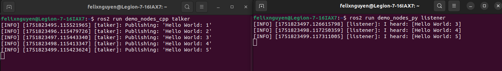

# A Guide to ROS 2 Humble Setup on Ubuntu 22.04

**ROS2 Humble Hawksbill** (released May 2022) is a long-term support (LTS) version of the **Robot Operating System 2 (ROS 2)** — an open-source framework for building robot applications. It provides the essential infrastructure for robot software development, including message passing, service handling, and hardware abstraction.

## I. ROS 2 Humble Installation

### 1. Setting Up Locale

Make sure you have a locale which supports `UTF-8`.

```sh
locale  # check for UTF-8
sudo apt update && sudo apt install locales
sudo locale-gen en_US en_US.UTF-8
sudo update-locale LC_ALL=en_US.UTF-8 LANG=en_US.UTF-8
export LANG=en_US.UTF-8
locale  # verify settings
```

### 2. Installing Dependencies

First, you ensure that the **Ubuntu Universe repository** is enabled.

```sh
sudo apt install -y wget curl software-properties-common
sudo add-apt-repository universe
```

The `ros-apt-source` packages provide keys and apt source configuration for the various ROS repositories. Installing the `ros2-apt-source` package will configure ROS 2 repositories for your system. Updates to repository configuration will occur automatically when new versions of this package are released to the ROS repositories.

```sh
export ROS_APT_SOURCE_VERSION=$(curl -s https://api.github.com/repos/ros-infrastructure/ros-apt-source/releases/latest | grep -F "tag_name" | awk -F\" '{print $4}')
curl -L -o /tmp/ros2-apt-source.deb "https://github.com/ros-infrastructure/ros-apt-source/releases/download/${ROS_APT_SOURCE_VERSION}/ros2-apt-source_${ROS_APT_SOURCE_VERSION}.$(. /etc/os-release && echo $VERSION_CODENAME)_all.deb" # If using Ubuntu derivates use $UBUNTU_CODENAME
sudo dpkg -i /tmp/ros2-apt-source.deb
```

### 3. Installing ROS 2 Humble

Update the `APT` repository caches after setting up the repositories.

```sh
sudo apt update -y && sudo apt upgrade -y
```

We will install `ros-humble-desktop-full`, which installs everything from **core ROS 2 packages**, **desktop tools**, **percetion tools**, **navigation and SLAM**.

```sh
sudo apt install -y ros-humble-desktop-full
```

For compilers and other tools to build ROS packages, you also install `ros-dev-tools`.

```sh
sudo apt install -y ros-dev-tools
```

### 4. Setting up ROS 2 Environment

Initiate ROS environment by using `rosdep`.

```sh
sudo rosdep init
rosdep update
```

Set up environment variables by adding the following text blocks to `~/.bashrc`:

```sh
# >>> ROS 2 environment setup >>>
source /opt/ros/humble/setup.bash
# <<< ROS 2 environment setup <<<
```

Then source `~/.bashrc` file to activate.

```sh
source ~/.bashrc
```

### 3. Verifying Installation

If you installed `ros-humble-desktop-full` above you can try some examples.

In one terminal, source the setup file and then run a C++ `talker` node:

```sh
ros2 run demo_nodes_cpp talker
```

In another terminal, source the setup file and then run a Python `listener` node:

```sh
ros2 run demo_nodes_py listener
```

You should see the `talker` saying that it’s `Publishing` messages and the `listener` saying `I heard` those messages.



## III. (Optional) ROS 2 Humble Uninstallation

If you need to uninstall ROS 2 or switch to a source-based install once you have already installed from binaries, run the following command:

```sh
sudo apt remove ~nros-humble-* && sudo apt autoremove -y
```

You may also want to remove the repository:

```sh
sudo apt remove -y ros2-apt-source
sudo apt update -y && sudo apt autoremove -y && sudo apt upgrade -y
```

## Conclusion

You have successfully installed ROS 2 Humble Hawksbill, the long-term support release for professional robotics development. You've set up a powerful and complex framework, laying the essential groundwork for building everything from simple hobby robots to sophisticated autonomous systems.

The ROS community is vast, active, and supportive. You've taken the first and most important step to becoming a part of if. Happy building!
